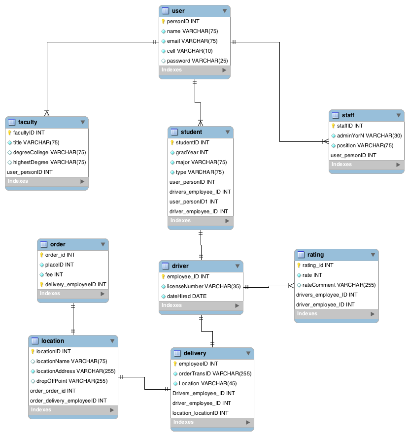

# ITCS_3160_Project

Individual project

Name: Visa Xiong

### Introduction
UNCC-Serve (By Visa Xiong)

#### Description:
UNCC-Serve is here to help students order and deliver their food securely on campus. We make sure that your order is delivered on time and save on prices. We are here to delivery you all sorts of food to your dorm or anywhere on campus!  
  In this project, I will create a database system for a delivery service provided for students on campus. I will be using MySQL as my primary workbench to create this database.
  
### Use Case

### Business Rules
- The project illustrates a delivery service between the Customer and the Company.
- Users can create an account associated with their University to access the delivery services.
- Users creates an account with their name, email, username, password, cell, and occupation. Users are verified by email.
- Users can create multiple orders/deliveries.
- Users can be drivers that are approved by Admin with license number and etc.
- Admin is a user who can add/remove restaurants and promotions on deliveries.
- Admin is a user who can add/remove users.

### EERD

### Data Dictionary

#### USER

| Column  | Data Type | Description |
| --- | --- | --- |
| PersonID | varchar(100) | User's ID number |
| Name | varchar(255) | User's full name |
| Email | varchar(255) | User's email for verification |
| Cell | varchar(45) | User's cell number |
| Password | varchar(45) | User's password for access |

#### Staff

| Column  | Data Type | Description |
| --- | --- | --- |
| --- | --- | --- |
| --- | --- | --- |
| --- | --- | --- |
| --- | --- | --- |
| --- | --- | --- |
| --- | --- | --- |
#### Faculty

| Column  | Data Type | Description |
| --- | --- | --- |
| --- | --- | --- |
| --- | --- | --- |
| --- | --- | --- |
| --- | --- | --- |
| --- | --- | --- |
| --- | --- | --- |

#### Student

| Column  | Data Type | Description |
| --- | --- | --- |
| --- | --- | --- |
| --- | --- | --- |
| --- | --- | --- |
| --- | --- | --- |
| --- | --- | --- |
| --- | --- | --- |

#### Drivers

| Column  | Data Type | Description |
| --- | --- | --- |
| --- | --- | --- |
| --- | --- | --- |
| --- | --- | --- |
| --- | --- | --- |
| --- | --- | --- |
| --- | --- | --- |
#### Rating

| Column  | Data Type | Description |
| --- | --- | --- |
| --- | --- | --- |
| --- | --- | --- |
| --- | --- | --- |
| --- | --- | --- |
| --- | --- | --- |
| --- | --- | --- |

#### Order

| Column  | Data Type | Description |
| --- | --- | --- |
| --- | --- | --- |
| --- | --- | --- |
| --- | --- | --- |
| --- | --- | --- |
| --- | --- | --- |
| --- | --- | --- |

#### Delivery

| Column  | Data Type | Description |
| --- | --- | --- |
| --- | --- | --- |
| --- | --- | --- |
| --- | --- | --- |
| --- | --- | --- |
| --- | --- | --- |
| --- | --- | --- |

 #### Location

| Column  | Data Type | Description |
| --- | --- | --- |
| --- | --- | --- |
| --- | --- | --- |
| --- | --- | --- |
| --- | --- | --- |
| --- | --- | --- |
| --- | --- | --- |

