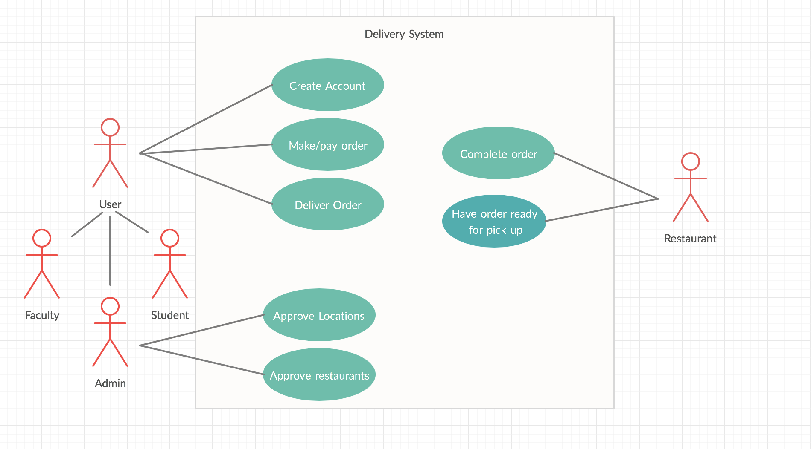

# ITCS_3160_Project

Individual project

Name: Visa Xiong

### Introduction
UNCC-Serve (By Visa Xiong)

#### Description:
UNCC-Serve is here to help students order and deliver their food securely on campus. We make sure that your order is delivered on time and save on prices. We are here to delivery you all sorts of food to your dorm or anywhere on campus!  
  In this project, I will create a database system for a delivery service provided for students on campus. I will be using MySQL as my primary workbench to create this database.
  
### Use Case

### Business Rules
- The project illustrates a delivery service between the Customer and the Company.
- Users can create an account associated with their University to access the delivery services.
- Users creates an account with their name, email, username, password, cell, and occupation. Users are verified by email.
- Users can create multiple orders/deliveries.
- Users can be drivers that are approved by Admin with license number and etc.
- Admin is a user who can add/remove restaurants and promotions on deliveries.
- Admin is a user who can add/remove users.

### EERD

### Data Dictionary

#### USER

| Column  | Data Type | Description |
| --- | --- | --- |
| PersonID | varchar(100) | User's ID number |
| Name | varchar(255) | User's full name |
| Email | varchar(255) | User's email for verification |
| Cell | varchar(45) | User's cell number |
| Password | varchar(45) | User's password for access |

#### Staff

| Column  | Data Type | Description |
| --- | --- | --- |
| StaffID | varchar(100) | Staff's ID number |
| AdminYorN | varchar(255) | If the staff is an adminstrator of UNCC-Serve |
| Position | varchar(45) | Staff's position at university |

#### Faculty

| Column  | Data Type | Description |
| --- | --- | --- |
| FacultyID | varchar(45) | Faculty's ID number |
| Title | varchar(255) | Faculty's title |
| DegreeCollege | varchar(255) | Faculty's type of degree |
| HighestDegree | varchar(45) | Faculty's highest degree obtained |

#### Student

| Column  | Data Type | Description |
| --- | --- | --- |
| StudentID | varchar(45) | Student's ID number |
| GradYear | int | Student's graudation year |
| Major | varchar(255) | Student's type of major |
| Type | varchar(45) | If the student is undergraduate or graduate |

#### Drivers

| Column  | Data Type | Description |
| --- | --- | --- |
| LicenseNumber | varchar(100) | Driver's license number |
| DateHired | DATETIME | The date that the driver was hired |

#### Rating

| Column  | Data Type | Description |
| --- | --- | --- |
| Rating_id | int | The Rating ID number |
| Rate | int | The number of stars given to driver |
| RateComment | varchar(255) | Comments located under the rates |

#### Order

| Column  | Data Type | Description |
| --- | --- | --- |
| PersonID | varchar(255) | The ID of the user's order |
| PlaceID | varchar(255) | The ID of the user's order's location |
| Fee | int | The intial flat fee of $5 for each delivery |

#### Delivery

| Column  | Data Type | Description |
| --- | --- | --- |
| employeeID | varchar(255) | The employee's ID number |
| OrderTransID | varchar(255) | The order transaction number |
| Location | varchar(45) | The location the order is being delivered |

 #### Location

| Column  | Data Type | Description |
| --- | --- | --- |
| LocationID | int | The Location's ID number of the order |
| LocationName | varchar(255) | The name of the location |
| LocationAddress | varchar(45) | The address of the location  |
| DropOffPoint | varchar(45) | Quick summary of a drop-off point |

